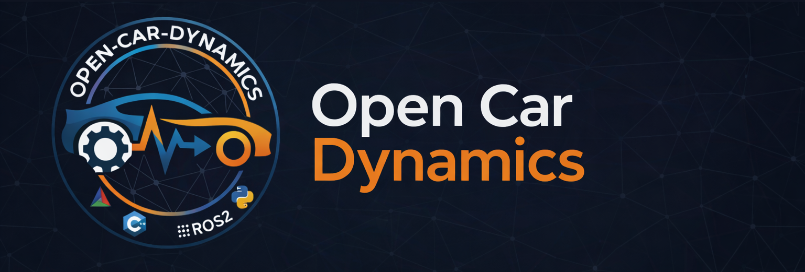
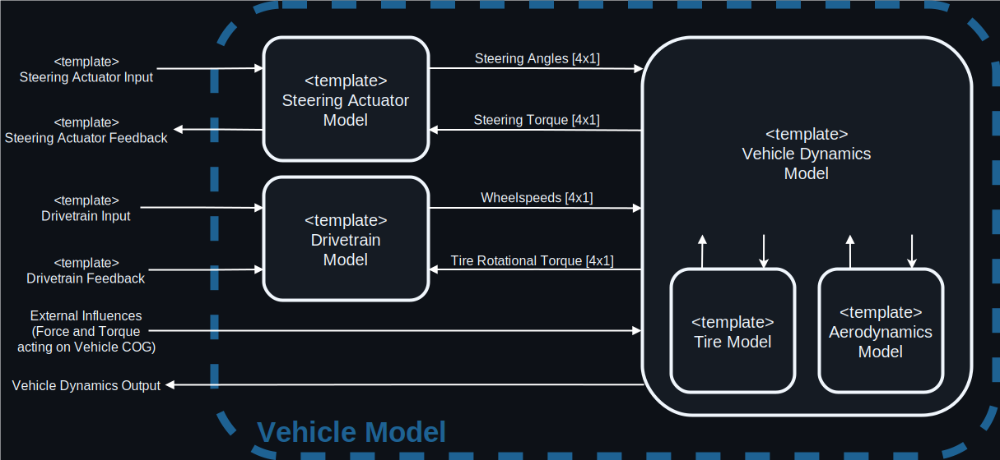

<div align="center">
    
</div>

<div align="center" style="margin-bottom: 30px;">
<p>
Open Car Dynamics provides a comprehensive, modular, and highly efficient implementation of a vehicle's dynamic behavior. 
Following the philosophy of modeling vehicle behavior "in as much detail as necessary, but as simply as possible," the library drastically simplifies parametrization and adaptation to custom requirements. 
Written in modern <b>C++</b> for maximum performance, the library offers seamless integrations for <b>Python</b> and <b>ROS 2</b>. 
Furthermore, vehicle dynamics has been rigorously validated against data recorded with the AV21 autonomous racecar used in the <a href="https://www.indyautonomouschallenge.com/">Indy Autonomous Challenge</a> to ensure simulation accuracy and reliability.
</p>
</div>

<div align="center" style="margin-bottom: 30px;">

[](https://isocpp.org/)
[](https://cmake.org/)
[](https://www.docker.com/)
[](https://www.apache.org/licenses/LICENSE-2.0)
[](https://doi.org/10.1109/IV55156.2024.10588858)
<br>

[](https://www.python.org/)
[](https://docs.ros.org/en/humble/)

</div>


--- 

## Table of Contents
- [1. How it works](#1-how-it-works)
- [2. Compiling and Running the Model](#2-compiling-and-running-the-model)
  - [2.1. Prerequisites](#21-prerequisites)
  - [2.2. Clone Repository](#22-clone-repository)
  - [2.3. Compile Using CMake](#23-compile-using-cmake)
  - [2.4. Compile and Run the ROS 2 Nodes](#24-compile-and-run-the-ros-2-nodes)
  - [2.5. Compile the Python Bindings](#25-compile-the-python-bindings)
  - [2.6. Compile the Python Bindings without ROS 2 installed](#26-compile-the-python-bindings-without-ros-2-installed)
- [3. Parameters](#3-parameters)
- [4. Contributing](#4-contributing)
- [5. Related Projects](#5-related-projects)
- [6. References](#6-references)

## 1. How it works

The model is designed to be an ordinary differential equation in state-space formulation. 
This state space model is solved using the Dormand-Prince scheme with a constant integration step size to enable real-time execution.

To achieve modularity, each vehicle model consists of 3 different submodels:
- Vehicle Dynamics
- Drivetrain
- Steering Actuator

The interfaces connecting the different models are shown in the following figure:

<div align="center">
    
</div>


Furthermore, the vehicle dynamics models can incorporate submodels for modeling aerodynamics and tire behavior.
However, these models are stateless, which distinguishes them from the 3 submodels mentioned above.

All of these 5 submodel components can be freely combined with each other, enabling a vast number of different vehicle implementations.
With this design, our library is able to model a lot of different vehicles without modifying the source code, also enabling rapid extension and collaboration. New variations of any submodel can be created by just inheriting and implementing the corresponding base class.

The submodels are automatically combined at compile time (hence the heavy templating in this library) by concatenating their
state vectors to form one big model.
Since combination happens at compile time, the compiler is able to heavily optimize the model, making it highly efficient. 
Even the most complex model currently inside the repository achieves 
a full simulation time step (using Dormand-Prince~ode4 integration) with an execution 
time below 10 µs on our benchmark system (AMD Ryzen 9 7950X).


## 2. Compiling and Running the Model

The model and its different bindings (ROS 2, Python) can be compiled in multiple ways from source.
First, ensure you meet the prerequisites in section 2.1.

Afterwards, refer to the respective subsection depending on how and what you want to compile.

### 2.1. Prerequisites

Before building, ensure you have the following installed:
- **OS:** Ubuntu 22.04 or 24.04
- **Compiler:** A modern C++ compiler (GCC/Clang) supporting C++20
- **Build Tools:** CMake (>= 3.18), Make/Ninja
- **Libraries:** Eigen3, Boost
- *(Optional)* **ROS 2:** Humble or Jazzy (for ROS 2 nodes and Python bindings)
- *(Optional)* **Docker:** If building Python bindings without a local ROS 2 installation

### 2.2. Clone Repository

First clone the repository using the command:

```bash
git clone --recursive https://github.com/TUMFTM/Open-Car-Dynamics.git
```

Then install the required system dependencies:
```bash
sudo apt update
sudo apt install libboost-dev libeigen3-dev build-essential cmake
```

### 2.3. Compile Using CMake

Our build system is build on colcon and ament, the build tools of ROS2.
However, for building the open car dynamics library without having `ros2`/`colcon`/`ament` installed, we provide an extra CMakeLists.txt in the 
folder [cmake_build](./cmake_build/).

To build the project using cmake, just paste the following commands one after another into your terminal.

```bash
cd cmake_build
```
```bash
mkdir build && cd build
```
```bash
cmake ..
```
```bash
cmake --build .
```

For installing the library, run the following command inside the `<RepoRoot>/cmake_build/build` folder after building.
```bash
cmake --install . 
```

This creates a folder under `<RepoRoot>/cmake_build/install`. This folder acts as an overlay.
To use the library, just source the `<RepoRoot>/cmake_build/install/setup.sh` script in your shell.
After sourcing, the library can be linked correctly.

To install the library correctly, just source the file in your `.bashrc` file by running this command in the **Root of your Repository**:
```bash
echo "source $PWD/cmake_build/install/setup.sh" >> ~/.bashrc
```

### 2.4. Compile and Run the ROS 2 Nodes

For using the model in a ROS 2 environment, we provide a generic wrapper node which wraps 
a certain vehicle model into a ROS 2 node. 

The ROS 2 packages can be compiled by first installing the required dependencies for building with ROS 2 installed:
```bash
sudo apt install libboost-dev ros-${ROS_DISTRO}-can-msgs ros-${ROS_DISTRO}-ros2-socketcan ros-${ROS_DISTRO}-geographic-msgs
```

Afterwards, you can just compile the correct packages using:
```bash
colcon build --packages-up-to ocd_vehicle_nodes_cpp --cmake-args -DCMAKE_BUILD_TYPE=Release
```

Afterwards, just source your compiled install folder and check the available `rclcpp components` by using the command
```bash
ros2 component types ocd_vehicle_nodes_cpp
```
 
Alternatively, you can directly run the nodes by starting their executable. 
Finding the executables can be done using the command
```bash
ros2 pkg executables ocd_vehicle_nodes_cpp
```

### 2.5. Compile the Python Bindings

Since we use colcon and ament as build systems, compiling the Python bindings is simplest
when having an active ROS 2 installation.

With ROS 2 and the required dependencies installed, compiling the bindings is as simple as
```bash
colcon build --packages-up-to ocd_vehicle_models_py --cmake-args -DCMAKE_BUILD_TYPE=Release
```

After sourcing the install folder, the different vehicle models can be created using a 
`VehicleFactory`. For a small example on how to use the models from Python, please refer to [our Python usage example](python3/ocd_vehicle_models_py/example/example.py)


### 2.6. Compile the Python Bindings without ROS 2 installed

For users who do not have an active ROS 2 installation, we provide the following workaround
to still be able to use the library without having to install ROS 2.

For this to work, please make sure you install docker and all dependencies from section 2.1.
Note: For the following commands, it is assumed you can run docker commands without sudo (your user should be in the docker group)
If not prepend sudo for any docker command.

First compile the bindings in the docker container using the following command in the root of this repository.

```bash
docker run  \
    --rm \
    -v "$PWD":"$PWD" \
    -w "$PWD" \
    -it \
    ros:$(if [ "$(lsb_release -rs)" = "22.04" ]; then echo humble; elif [ "$(lsb_release -rs)" = "24.04" ]; then echo jazzy; fi) \
    bash -c "   \
        source /opt/ros/${ROS_DISTRO}/setup.bash && \
        apt update && \
        apt install -y libboost-dev ros-${ROS_DISTRO}-can-msgs ros-${ROS_DISTRO}-ros2-socketcan ros-${ROS_DISTRO}-geographic-msgs && \
        colcon build --merge-install --packages-up-to ocd_vehicle_models_py"
```

This creates a new folder `<Repository Root>/install`.

To use the compiled packages, just source the file `<Repository Root>/install/local_setup.sh` inside your `.bashrc` file.
You can do this quickly by running the following command in the root of this repo.

```bash
echo "source $PWD/install/local_setup.sh" >> ~/.bashrc
```

Be sure to create a new shell after modifying your `.bashrc` file.

After sourcing the install folder, the different vehicle models can be created using a 
`VehicleFactory`. For a small example on how to use the models from Python, please refer to [our Python usage example](python3/ocd_vehicle_models_py/example/example.py)


## 3. Parameters

For setting parameters, all models have a [Parameter Management Interface](https://github.com/TUMFTM/TAM__param_management/blob/main/param_management_cpp/include/param_management_cpp/base.hpp) defined.
This allows to get and set every parameter of the respective model.

All parameters are modifiable during the runtime of the model.

Managing parameters for the provided ROS 2 Nodes is simplest when using ROS 2 parameter files.
These can be created for a specific vehicle node using the command:
```bash
ros2 param dump /simulation/VehicleModel
```

Setting and getting parameters from Python is done using Python dictionaries.
For details see [our Python usage example](python3/ocd_vehicle_models_py/example/example.py).
We also provide the default parameters for each model as json file under [python3/ocd_vehicle_models_py/config](./python3/ocd_vehicle_models_py/config).

Unfortunately, we cannot provide meaningful parameter sets for the models.
This is because significant parts of the parametrization resembling the AV21 racecar are confidential.
Therefore, we can only provide a parametrization that resembles a generic single-seater race car equipped with a conventional on-road tire.

For tire parameters, we provide a set of MF52 parameters taken from https://github.com/TUMFTM/sim_vehicle_dynamics as default.
This parameter set resembles a sport focused road tire.

## 4. Contributing

We welcome contributions to Open Car Dynamics! Contributing is as simple as implementing a new submodel by inheriting and implementing a respective base class and creating a new package. Because of the modular design, your new submodel can then be seamlessly combined with existing components.

## 5. Related Projects

When building this vehicle model, we initially took inspiration from the [CommonRoad Vehicle Models](https://gitlab.lrz.de/tum-cps/commonroad-vehicle-models) Project. 
However, we needed a real-time capable, modularized model for an autonomous race-car which is why this project was started.


## 6. References

If you use Open Car Dynamics in your work please consider citing our paper [Analyzing the Impact of Simulation Fidelity on the Evaluation of Autonomous Driving Motion Control](https://ieeexplore.ieee.org/document/10588858/).
```
@INPROCEEDINGS{10588858,
  author={Sagmeister, Simon and Kounatidis, Panagiotis and Goblirsch, Sven and Lienkamp, Markus},
  booktitle={2024 IEEE Intelligent Vehicles Symposium (IV)}, 
  title={Analyzing the Impact of Simulation Fidelity on the Evaluation of Autonomous Driving Motion Control}, 
  year={2024},
  volume={},
  number={},
  pages={230-237},
  keywords={Measurement;Analytical models;Heuristic algorithms;Software algorithms;Approximation algorithms;Data models;Vehicle dynamics},
  doi={10.1109/IV55156.2024.10588858}}

```

### 6.1 Core Developers
 - [Simon Sagmeister](mailto:simon.sagmeister@tum.de)
 - Simon Hoffmann | Implementation of parts of the ROS2 and some of the dependency functions
 - Georg Jank | Implementation of parts of the template structure of this repo.

### 6.2 Acknowledgments

Several students contributed to the success of the project during their Bachelor's, Master's or Project Thesis.
 - Panagiotis Kounatidis | *Development of an initial version of this model as well as implementation of the tire model.*


Special thanks to my colleagues for the regular technical feedback and talks during the development phase of this model:
- Sven Goblirsch
- Frederik Werner


We gratefully acknowledge financial support by:
 - Deutsche Forschungsgemeinschaft (DFG, German Research Foundation) | Project Number - 469341384

