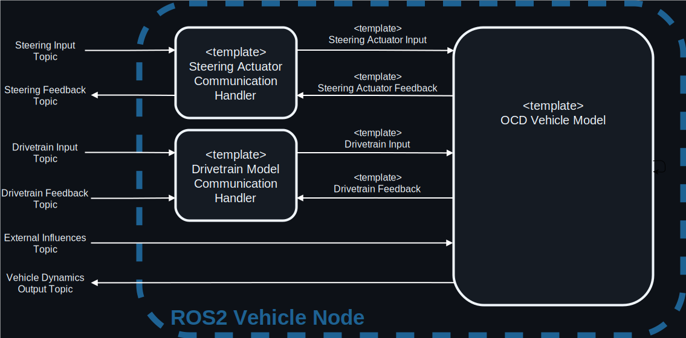

# Using OCD in ROS2

To use Open Car Dynamics Models in ROS 2, we provide a generic
wrapper node which wraps any vehicle model. 
Since the models differ in driver input and feedback types, we use a strategy pattern
to create the subscriptions and feedback publishing. 

These are called Strategies are named CommunicationHandlers.

They connect the Open Car Dynamics Models with the corresponding topics in ROS2.

    

## ROS2 Content

This folder contains several packages that can be built. Below is a list of the available packages along with a brief description of their contents.

| Package Name | Description |
|--------------|-------------|
| [`ocd_communication_handler_base_cpp`](./ocd_communication_handler_base_cpp/README.md) | Base class for communication handlers |
| [`ocd_drivetrain_fx_communication_handler_cpp`](./ocd_drivetrain_fx_communication_handler_cpp/README.md) | Communication handler for drivetrain fx |
| [`ocd_drivetrain_wheel_torque_communication_handler_cpp`](./ocd_drivetrain_wheel_torque_communication_handler_cpp/README.md) | Communication handler for drivetrain wheel torque |
| [`ocd_steering_actuator_pt1_communication_handler_cpp`](./ocd_steering_actuator_pt1_communication_handler_cpp/README.md) | Communication handler for steering actuator pt1 |
| [`ocd_vehicle_model_node_cpp`](./ocd_vehicle_model_node_cpp/README.md) | A generic ros2 node which serves a vehicle model |
| [`ocd_vehicle_nodes_cpp`](./ocd_vehicle_nodes_cpp/README.md) | Different vehicle models served as ROS2 nodes |
